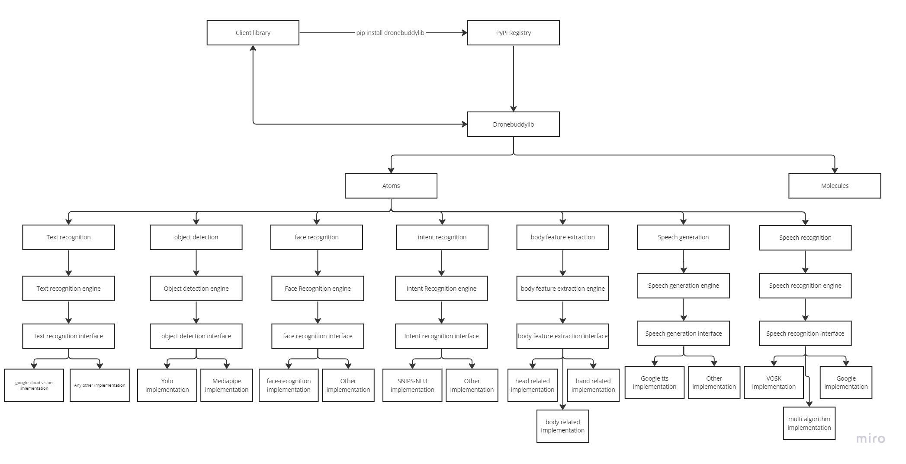

Developer Guide
==========

Coding Standards
------------

Code Formatting
----------------

The library was initially developedd on PyCharm IDE, which has a built-in PEP8 checker. The code should be PEP8 compliant, with the exception of the line length, which is set to 120 characters.

Please refer to the [PEP8 Style Guide](https://www.python.org/dev/peps/pep-0008/) for more information.

And with regards to the pycharm settings, please refer to the [PyCharm PEP8 Settings](https://www.jetbrains.com/help/pycharm/reformat-and-rearrange-code.html) for more information.

File Naming
----------------

FIle naming should be in lowercase, with underscores separating words. For example, `my_file.py`.
Please use meaningful names for files, and avoid generic names such as `test.py`.
For more information, please refer to the [PEP8 Style Guide](https://www.python.org/dev/peps/pep-0008/#prescriptive-naming-conventions).

The library maintains a folder structure, which is described in the [Folder Structure](#folder-structure) section. so when creating a new file, please make sure to place it in the correct folder.
If the file is a new module, please make sure to add it to the `__init__.py` file in the relevant folder.

Folder Structure
----------------
The main functionalities each have their own folder, and each folder has its own `__init__.py` file, which imports the relevant modules.
The folder structure is as follows:

* drone-buddy-library/
  * dist/
  * docs/
  * docs-sphinx/
  * dronebuddylib/
    * atoms/
      * bodyfeatureextraction/
      * facerecognition/
      * intentrecognition/
      * objectdetection/
      * speechgeneration/
      * speechrecognition/
      * textrecognition/
    * configurations/
    * exceptions/
    * models/
    * molecules/
    * utils/
    * __init__.py
    * gpt_integration.py
  * dronebuddylib.egg-info/
  * runs/
  * test/
  * venv/

Architecture
------------

The architecture for the library is as follows:

The class diagram for the library can be found here: [Class Diagram](https://app.diagrams.net/#Haugmented-human-lab%2Fdrone-buddy-library%2Fmain%2FDroneBuddy.drawio)

The library is divided into atoms and molecules, which are described in the [Library Structure](#library-structure) section.
The atoms are the basic building blocks of the library, and the molecules are the higher level functionalities, which are built using the atoms.

Library Structure
-----------------
In this section, we will describe the structure of the library, and the different modules that it contains.

### Atoms

If you believe the the functionality you plan is a very basic building box, and can be used in multiple molecules, then it should be an atom.

Each atomic module can have multiple implementations of the functionality and the user can choose which one to use by passing the relevant parameters to the molecule.

An atomic module has the following structure:

if we take object detection atomic module as an example

* objectdetection/
  * i_object_detection.py
  * object_detection_engine.py
  * mp_object_detection_impl.py
  * yolo_object_detection_impl.py
  * object_detection_result.py
  * __init__.py

The `i_object_detection.py` is an implementation of the abstract class `IDBLFunction`.

Basic structure of `i_object_detection.py`:
--------------------------------------------

`IDBLFunction` is an abstract class that defines the high-level structure for the atomic module. It has the following structure:

.. code-block:: Python

    class IDBLFunction(ABC):
    @abstractmethod
    def __init__(self):
        pass

    @abstractmethod
    def get_required_params(self) -> list:
        pass
    @abstractmethod
    def get_optional_params(self) -> list:
        pass

    @abstractmethod
    def get_class_name(self) -> str:
        pass

    @abstractmethod
    def get_algorithm_name(self) -> str:
        pass

This abstract class acts as a guideline for the future implementations of the atomic module.
Here,

`get_required_params()` defines the parameters that are compulsory for the implementations to work, for examples API_KEYS as such.
The enums should be defined at `models/AtomicEngineConfigurations.py` and then used in the get_required_params() method.
These will be passed the engine using `EngineConfigurations` class, after which will be validated by crosschecking the defined values in thee implementation class.

Defining enums in `AtomicEngineConfigurations.py`:

    `OBJECT_DETECTION_MP_MODELS_PATH` is formed by `get_class_name() + configuration name` and should be in uppercase.

.. code-block:: Python

      config_validity_check(self.get_required_params(),
                              engine_configurations.get_configurations_for_engine(self.get_class_name()),
                              self.get_algorithm_name())

`get_optional_params()` defines the parameters that are optional for the implementations to work, for examples fine  tuning parameters as such.

`get_class_name()` returns the name of the class, which is used to identify the class in the `AtomicEngineConfigurations` class.

`get_algorithm_name()` returns the name of the algorithm.

Implementations of i_object_detection.py
-----------------------------------------

.. important::

    The naming convention for the implementation class is `AlgorithmName` + `EngineName` + `Impl`, for example `YoloObjectDetectionImpl`.

When it comes to the implementation of the interface,
.. important::

    always verify the parameters passed to the implementation class using the `config_validity_check()` method.

object_detection_engine.py
--------------------------

The `object_detection_engine.py` is the engine that is used to run the atomic module. It acts as a wrapper for the implementations of the feature. The engine exposes the methods available to be used.
The purpose of this engine is to reduce the complexity for the clients so they don't have to worry about initializing the correct algorithm.
The engine also handles the configuration of the algorithm, and the parameters passed to it.

.. code-block:: Python

      def __init__(self, algorithm: VisionAlgorithm, config: EngineConfigurations):
        """
        Initializes the object detection engine with the specified algorithm and configuration.

        Args:
            algorithm (VisionAlgorithm): The vision algorithm to be used for object detection.
            config (EngineConfigurations): The configuration for the vision engine.
        """
        if algorithm == VisionAlgorithm.YOLO:
            logger.log_info('Preparing to initialize YOLO object detection engine.')
            from dronebuddylib.atoms.objectdetection.yolo_object_detection_impl import YOLOObjectDetectionImpl
            self.vision_engine = YOLOObjectDetectionImpl(config)
        elif algorithm == VisionAlgorithm.MEDIA_PIPE:
            logger.log_info('Preparing to initialize Mediapipe object detection engine.')
            from dronebuddylib.atoms.objectdetection.mp_object_detection_impl import MPObjectDetectionImpl
            self.vision_engine = MPObjectDetectionImpl(config)

Logging
-------

The library uses the `Logger` class to log messages. The logger class is defined in `utils/Logger.py`.
The class includes the following methods:

* `log_info(class_name, info_message)` - logs an info message in YELLOW.
* `log_warning(class_name, warning_message)` - logs a warning message in CYAN.
* `log_error(class_name, error_message)` - logs an error message in RED.
* `log_debug(class_name, debug_message)` - logs a debug message in BLUE.

.. important::
    Please use these methods to appropriately log messages, and do not use the `print()` function.

Release drone-buddy-library
===========================

#. Install build, [build](https://github.com/pypa/build)
.. code-block:: bash

    pip install build

#. Install twine, [twine](https://pypi.org/project/twine/)
.. code-block:: bash

    pip install --upgrade twine

#. Do the necessary development
    *. If introducing a new feature use a new python class in the dronebuddylib directory
    *. If not update the corresponding file

#.  If new methods that needs to be exposed by the library are introduced, declare the method names and all helper classes in the __init__.py

.. important::
    Always remember that the __init__.py file is the entry point for the library, so the methods that you declare in the __init__.py file will be exposed to the user and will be compiled when installing the library.
    So if you dont need to import the dependencies on installation do not mention the classes explicitly in the __init__.py file

#.  Update the version number in the setup.py file and the __init__.py files.

 .. note::
    The version number should be in the format of `major.minor.patch`, for example `1.0.0`.
    You can utilize the `test_update_version` class to update the version number in the setup.py file and the __init__.py files.

#. If there are any libraries required for the execution mention them in setup.py in install_requires=[]
#. It is good practice to declare the dependencies required to use each module. This can be done using specifying the dependencies as follows

.. code-block:: python

   extras_require={
        "FACE_RECOGNITION": ['face-recognition'],
        "INTENT_RECOGNITION_GPT": ['openai', 'tiktoken'],
        "INTENT_RECOGNITION_SNIPS": ['snips-nlu'],
        "OBJECT_DETECTION_MP": ['mediapipe'],
        "OBJECT_DETECTION_YOLO": ['ultralytics'],
        "TEXT_RECOGNITION": ['google-cloud-vision'],
        "SPEECH_RECOGNITION_MULTI": ['SpeechRecognition'],
        "SPEECH_RECOGNITION_VOSK": ['vosk'],
    }

Here the key is the name of the module and the value is the list of dependencies required to use the module. With this users will be able to install the dependencies required for the modules that they want to use by the following command:

.. code-block:: bash

    pip install dronebuddylib[<module_name>]

Release the library
-------------------

#. Build the library
.. code-block:: bash

    python setup.py sdist

This step creates a .tar.gz file in the dist file. Double check if the file created has the corrected version number

#. Create the wheel file
.. code-block:: bash

     py -m build
When this step executes, .whl file will be created with the version number. Double check this too

#. Upload the library to pypi or test pypi

if using the testpypi environment, use the following command
.. code-block:: bash

    python -m twine upload --repository testpypi dist/*

if using the pypi environment, use the following command
.. code-block:: bash

    python -m twine upload --repository pypi dist/*

#. YOu will be prompted for the username and password. Use the credentials of the dronebuddy account
#. Write to
.. _Email to Malsha:
    Email Malsha at `malshadz@nus.edu.sg <mailto:malshadz@nus.edu.sg>`_

to get the credentials, or if you have authorization to access the credentials visit the [Dronebuddy folder](https://docs.google.com/document/d/1PEBjiZCyPtjfHjF54C7YjlqW-dnpWyiwuduNJ38C4m0)

#. Once the library is uploaded, you can view it at
    *. https://test.pypi.org/project/dronebuddylib/
    *. https://pypi.org/project/dronebuddylib/

Sphinx Documentation
====================

The library uses Sphinx to generate documentation. The documentation is generated in the `docs-sphinx` folder.

#. Make sure each module has a `__init__.py` file and all the classes that you need to generate documentation for are imported in the `__init__.py` file.

#. Install Sphinx, [Sphinx](https://www.sphinx-doc.org/en/master/usage/installation.html)

#. Go to the `docs-sphinx` folder and run the following command
.. code-block:: bash
     sphinx-build -b html . _build -v

This will generate the .rst files in the `docs-sphinx` folder

#. Run the following command to generate the html files
.. code-block:: bash
     make html

#. The html files will be generated in the `docs-sphinx/build/html` folder

Publish to github pages
=======================

#. Move the html files to the `docs` folder
#. Commit and push the changes to the main branch
#. Go to the settings of the repository and scroll down to the GitHub Pages section
#. Select the `main` branch and the `docs` folder
#. Click on save
#. The documentation will be available at https://augmented-human-lab.github.io/drone-buddy-library/
